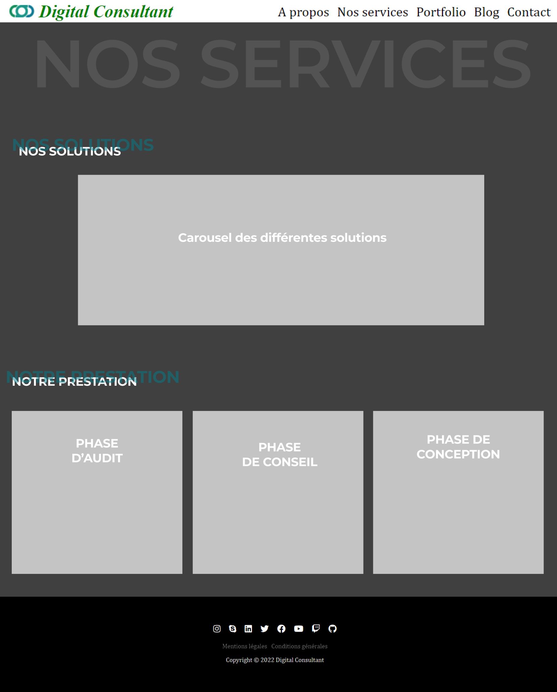
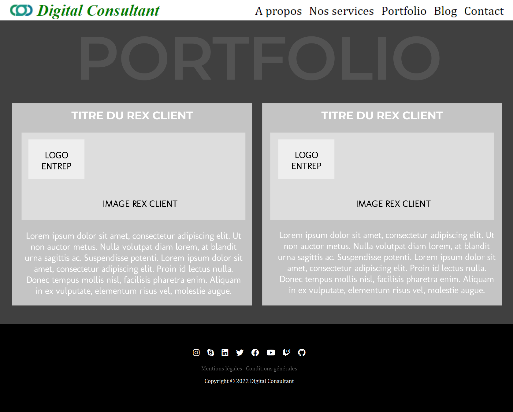
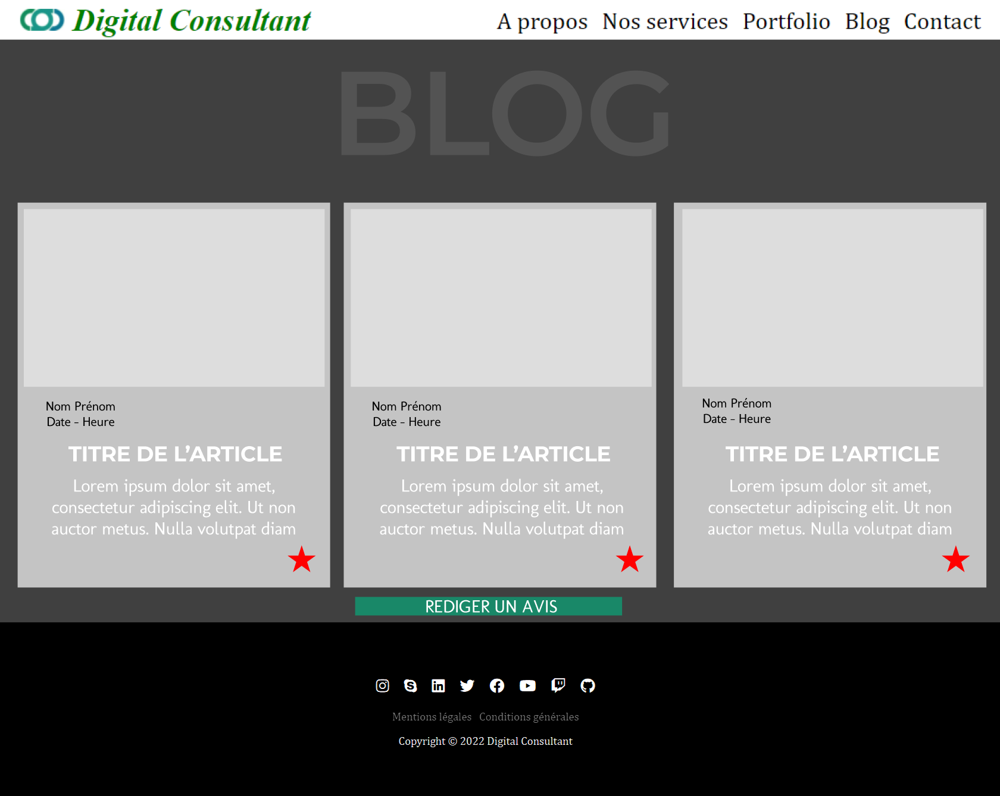
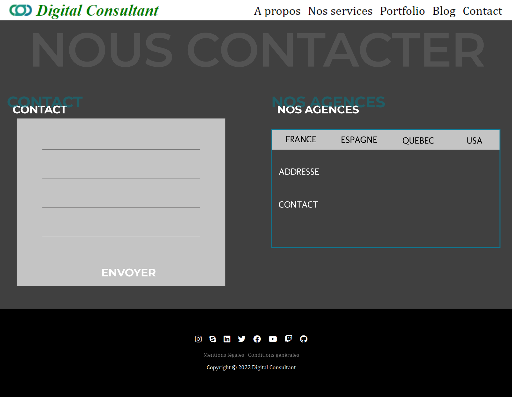

# CampusWorkShop2022-Team06

## Qui sommes-nous ?
Clément VITRAT, Bastien DUCIEL, Lucas GAUSSEN, trois étudiants en Bachelor 1 Info Tech à Aix-en-Provence. Pendant deux semaines (10 janvier 2022 - 21 janvier 2022), nous avons participer à un challenge, en lien avec les compétences associées à notre cursus. Nous avons réaliser l'intégralité d'un site internet pour une entreprise "Digital Consultant" (DC).

Voici le lien de notre site [Digital Consultant](https://clement-vitrat.github.io/CampusWorkshop2022-Team06/).

-------------------------
-------------------------

## Notre planning.
Afin de réaliser ce site, nous nous sommes fixer des objectifs.

|Date           |          Réalisations                                 |
|---------------|-------------------------------------------------------|
|10 janvier 2022|<ul><li>Découverte du groupe et du projet a réaliser</li><li>Étude du guide    pratique de la recommandation</li><li>Recherches des questions à poser à Digital Consultant</li><li>Début de la maquette</li></ul>|
|11 janvier 2022|<ul><li>Fin de la réalisation de la maquette de la "Landing page" et "A propos"</li><li>Début de la création du site internet (html, css)</li></ul>|
|12 janvier 2022|<ul><li>Avancement de la page "Accueil" et "A propos"</li><li>Choix des différentes propriétés visuels du site (couleurs, polices...)</ul>|
|13 janvier 2022|<ul><li>Avancement de la page "Accueil" et "A propos"</li><li>Contact avec Quentin Miltgen afin d'avoir plus de renseignements</li></ul>|
|14 janvier 2022|<ul><li>Réunion le matin avec le client pour avoir plus de renseignements</li><li>Création de la maquette de la page "Nos services"</li><li>Début de la création de la page "Nos Services"</li><li>Création du "footer" et de la "barre de navigation"</li></ul>|
|15/16 janver 2022|<ul><li>Création du "Chat Bot"</li><li>Continuité du site internet</li><li>Remplacement de tous le "Bootstrap" par du "grid"</li></ul>|
|17 janvier 2022|<ul><li>Création de la page "Contact</li><li>Recherche et création des "Mentions légales" et "CGU"</li></ul>|
|18 janvier 2022|<ul><li>Début de réalisation de la page "Portfolio" et "Blog"</li><li>Création de l'abonnement à la "Newsletter" sur la page d'accueil</li></ul>|
|19 janvier 2022|<ul><li>Création du bandeau des cookies</li><li>Avancement des pages "Portfolio" et "Blog"</li></ul>|
|20 janvier 2022|<ul><li>Finition de la page "Portfolio", "Blog" et "Accueil"</li><li>Réalisation du "README.md"</li><li>Création du PowerPoint pour la présentation Oral</li><li>Vérification de toutes les pages du site</li></ul>|
|21 janvier 2022|<ul><li>Oral final</li></ul>|

-------------------------
-------------------------

## Langages utilisés.
Les différents langages que nous avons utilisés pour réaliser notre site internet sont :
* __HTML__ : HyperText Markup Language
* __CSS__ : Cascading Style Sheets
* __JS__ : JavaScript
* __JSON__ : JavaScript Object Notation
* __MD__ : Markdown

-------------------------
-------------------------

## Logiciels utilisés.
Pour créer notre site internet, nous avons du utiliser plusieurs logiciels :
* *Editeur de code* :
    * __Visual Studio Code__
    * __GitHub__
* *Moteur de recherche* :
    * __Chrome Google__
    * __Microsoft Edge__
    * __Opera GX__
* *Réalisation des Wireframes* :
    * __Figma__
    * __Axure__

-------------------------
-------------------------

## Les Wireframes.
Le Wireframe appelé également maquette fonctionnelle ou maquette de fil de fer est une représentation visuelle de l'interface d'une page web. Voici nos Wireframes réalisé.

### __Maquette de la "Landing Page" (page d'accueil)__

 

### __Maquette de la page de "présentation de l'entreprise" (à propos)__

 

### __Maquette de la page résumant "nos offres" (nos services)__

 

### __Maquette de la page de type portfolio pour présenter "nos Rex Client"__

 

### __Maquette de la page contenant un "blog"__

 

### __Maquette de la page contenant un "formulaire de contact"__

-------------------------
-------------------------

## Liste des fonctionnalités.
Pour réaliser un belle interface utilisateur et un joli rendu, nous avons mis en place différentes fonctionnalités sont les suivantes.
* __Ajouter un article__ : l'utilisateur pourra ajouter un article depuis la page "Blog". Il devra rentrer son nom prénom et le commentaire de l'article (titre, article).
* __Contacter Digital Consultant__ : l'utilisateur pourra contacter Digital Consultant depuis la page "Contact" en entrant ces informations personnelles (nom, prénom, adresse mail, téléphone) et le message à envoyer.
* __Donner des renseignements__ : l'utilisateur pourra discuter avec un "chat bot" disponible uniquement sur la page "A propos" qui lui donnera des informations sur la prestation et les différents solutions que Digital Consultant peut réaliser.

-------------------------
-------------------------

## Conclusion.
Ces deux semaines de WorkShop Tech nous on permis de découvrir le travail en groupe avec un but précis à réaliser. De plus, nous avons tous appris de nouvelles choses, de nouveaux langages mais surtout appris des un et des autres.

Merci à *Campus Academy* et *Digital Consultant* pour ce challenge et ce projet.

Merci aux annonceurs pour nous avoir accompagné pendant ces deux semaines.

